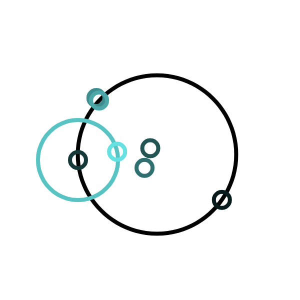
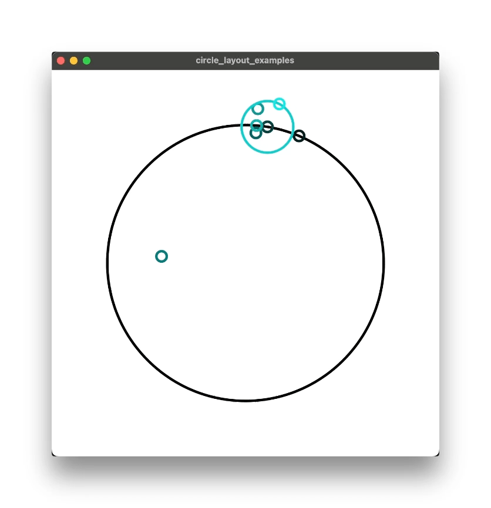

[![MIT License][license-shield]][license-url]


---

<br />
<div align="center">
  <a href="https://github.com/leonp-s/juce_circle_layout">
    
  </a>
  <h3 align="center">juce_circle_layout</h3>
  <p align="center">
    An easy to use 'flex-box' style utility for layouts based around circles.
  </p>
</div>

# Usage

# Examples

A relatively complex layout as seen below can be achieved quite concisely, including nested sub-layouts, using a declarative approach similar to JUCEs flex-box.

<div align="center">

</div>

```cpp
CircleLayout orbit_layout;
orbit_layout.items.add (CircleLayout::Item ()
                            .WithAnchor (CircleLayout::Anchor::kCircumference)
                            .WithCircle (small_circle.WithRotationDegrees (rotation_ * 4.0f)));

CircleLayout layout;
layout.items.add (CircleLayout::Item ()
                      .WithAnchor (CircleLayout::Anchor::kCircumference)
                      .WithCircle (small_circle.WithRotationDegrees (rotation_ * 4.0f)));

layout.items.add (CircleLayout::Item ()
                      .WithAnchor (CircleLayout::Anchor::kCircumference)
                      .WithCircle (small_circle.WithRotationDegrees (rotation_)));

layout.items.add (CircleLayout::Item ()
                      .WithAnchor (CircleLayout::Anchor::kCentre)
                      .WithOffsetRelative ({0.f, std::sin (rotation_ * 0.1f)})
                      .WithCircle (small_circle));

layout.items.add (CircleLayout::Item ()
                      .WithAnchor (CircleLayout::Anchor::kCentre)
                      .WithOffsetRelative ({std::sin (rotation_ * 0.2f), 0.f})
                      .WithCircle (small_circle));

layout.items.add (CircleLayout::Item ()
                      .WithAnchor (CircleLayout::Anchor::kCircumference)
                      .WithOffsetRelative ({0.0f, std::sin (rotation_ * 0.2f) * 0.2f})
                      .WithCircle (small_circle));

layout.items.add (CircleLayout::Item ()
                      .WithAnchor (CircleLayout::Anchor::kCircumference)
                      .WithCircle (small_circle));

layout.items.add (CircleLayout::Item ()
                      .WithCircleLayout (orbit_layout)
                      .WithAnchor (CircleLayout::Anchor::kCircumference)
                      .WithCircle (medium_circle.WithRotationDegrees (rotation_)));

layout.PerformLayout (outer_circle);
```

[license-shield]: https://img.shields.io/github/license/leonp-s/juce_circle_layout.svg?style=for-the-badge
[license-url]: https://github.com/leonp-s/juce_circle_layout/blob/main/LICENSE